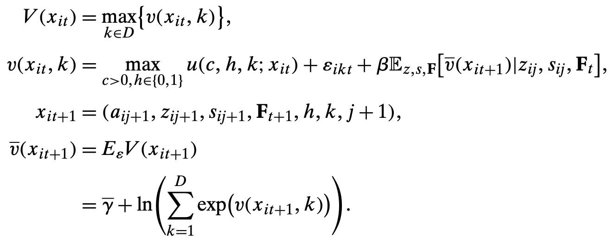
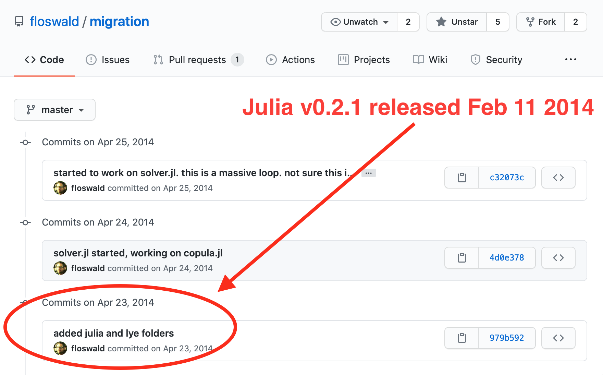

title: Computational Economics
class: animation-fade
layout: true
author: Florian Oswald, SciencesPo 2021

<!-- This slide will serve as the base layout for all your slides -->
.bottom-bar[
  {{author}}
]

---

class: impact

# {{title}}
## SciencesPo 2021
### Florian Oswald

---

# Today's Agenda

1. Logistics.

--

2. Why Economists Must Talk About Computing.

--

3. How to Choose a Programming Language.

---

# Who Am I? 

.col-6[

### Research
- Assistant Prof at the Department of Economics at ScPo in Paris

- Housing, Macro, Labor and Urban

- Experience with HPC systems, AWS and google cloud

- Research projects in `fortran`, `C++`,  `R`, `julia`, `python` and `PostgreSQL`

]

--

.col-6[

.center[
]
]


---

## Logistics and Course Structure

* Meetings: Every Friday except 26 Feb

--

* Communication: Slack

--

* Materials: All online via [course website](https://floswald.github.io/NumericalMethods)

--

* Grades: 60% homeworks, 40% term project
    * Will specify explicitly whether teamwork or single submission!
    * Term project in teams of 2.

--

* Term Project: Replicate a published paper with computational content.
    * More info [on syllabus](https://floswald.github.io/NumericalMethods/#term_project)
    * Deadline for your proposal: March 5.
    * Deadline for hand in: end of term.


---

# Economists and Computation I

.small[This part borrows heavily from [Jesus Fernandez-Villaverde's lectures. Thanks Jesus!](https://www.sas.upenn.edu/~jesusfv/teaching.html)
]

Computation has become an important tool in Economics: 

1. Macro: Solution of DSGE models, forecasting models, ...
2. Micro: Agent-based models, games, life-cycle models, high-dimensional fixed effects models ...
3. Econometrics: Simulation-based estimators and large datasets, ...
4. Trade and spatial economics: multi-country-firm-type models, with dynamics, ...
5. Finance: Asset Pricing, Value at Risk models, ...

---

# Economists and Computation II

* [Ken Judd](https://web.stanford.edu/~judd/): Computation often *complements*, rather than substitutes, theory. 
    > If theory shows that some partial derivative of interest is *positive*, computation can tell us *how positive*.

--

* Economics is not different from many other fields. 
    - Computational Biology (e.g. `R` Bioconductor)
    - Computational Chemistry
    - Physics, Engineering, Applied Maths
    - Comparative Literature
    - Astronomy

--

* [Research is now fundamentally connected to software](https://www.nature.com/articles/d41586-021-00075-2)


---

# What Does This Mean for You?

1. You (will) spend a considerable amount of your time writing code.

--

2. You (will) collaborate with coauthors and colleagues on code.

--

3. You (will) read and evaluate papers that use computational methods

--

4. (Hopefully you will be supplied with the paper's code for your evaluation.)

--

5. For all practical purposes, **you are a research software engineer**. 👷‍♀️ 👷🏽‍♂️ Carefully choose the best methods for software engineering at any time. 

--

**Past:** *Software just happens*.  
**Present:** *The vast majority of research software is single use and poor quality*.  
**Future:** *That's you guys!* 💪


---

# Gentzkow and Shapiro

>Here is a good rule of thumb: If you are trying to solve a problem, and there are multi-billion dollar firms whose entire business model depends on solving the same problem, and there are whole courses at your university devoted to how to solve that problem, you might want to figure out what the experts do and see if you can’t learn something from it.

* [Gentzkow and Shapiro: Code and Data](https://web.stanford.edu/%7Egentzkow/research/CodeAndData.pdf)
* [GSLab-econ](https://github.com/gslab-econ)
* [RA-manual](https://github.com/gslab-econ/ra-manual/wiki)
* Whatever you do: don't reinvent the wheel. ☸️

* [A Gentle Introduction to Effective Computing in Quantitative Research](https://mitpress.mit.edu/books/gentle-introduction-effective-computing-quantitative-research)


---
background-image: url(fortranmanual.png)
background-size: 300px 180px
background-position: 60% 25%

# Aim of This Course

* Take the *fear* out of computation.

<br>
<br>
<br>
--

* Provide you with a set of tools based on which you can learn to tackle frontier computational problems.

--

* Teach you some best practices from Open Source Software (OSS)

--

* Provide an opportunity to create links across institutions! 🤝 🇪🇺

--

* Have some fun! 🎉

---

class: impact

# Programming Languages
## How To Choose?

---

# Choosing a Language

* You are an economics grad student and need to choose your *weapon of choice*.

--

* You will use more than one language. (This is a good thing.)

--

* All Languages have pros and cons. I will give some opinionated advice.

--

* Then I will force you to use a certain language to complete homeworks 😜

---

# Taxonomy of Languages

.center[]


---

class: impact

# The Pros/Cons Rundown

---

# Hello, World?

--

* It's good custom to first print `hello world` when introducing a language. It's fun, but pretty uninformative. Like, *what's the performance of printing "hello, world"?*

--

* Instead, we will show in each language how to implement the function `sum over an array` of values `a`:
    $$\text{sum}(a) = \sum_{i=1}^n a_i$$
    where $n$ is the number of elements in $a$

* Later, we will then *benchmark* each language to see tradeoff between high- and low level languages.

---

# `C/C++`

* The world pretty much runs on `C++`.

--

* If you now some `C++` and some `Unix` you know a lot already.

--

* Developed at Bell Labs in 1980s.

--

* All `C` programs are valid `C++`, not other way around.

---


```C
//sumvec.cpp
#include <iostream>
#include <vector>
int main(){
    std::vector<int> x;
    for (int i=1;i<5;i++){
        x.push_back(i);
    }
    int sum = 0;
    for (std::vector<int>::iterator i=x.begin();i!=x.end();i++){
        sum += *i;
    }
    std::cout << "sum is " << sum << std::endl;
}
//compile
g++ sumvec.cpp -o sum.x
```

---

# `C sum`

* Defining the function:
    ```C
    #include <stddef.h>
    double c_sum(size_t n, double *X) {
        double s = 0.0;
        for (size_t i = 0; i < n; ++i) {
            s += X[i];
        }
        return s;
    }
    ```
* place in `main()`, compile and run as above.

---

# `C++`: Pros and Cons

.col-6[
### Pros
* Very versatile.
* Continuously Evolving. C++ 2019 standard is current.
* Very performant.
* Excellent open source compilers.
* Very stable and widely used.
* Large community.]

--

.col-6[
### Cons
* Hard to learn. Pointers, Classes, OOP in general.
* Some find it hard to work with Compiled languages.
* It's easy to overcomplicate things for novices.]


---

# Python

* *The* general purpose language out there. Swiss Army Knife. All Terrain. 🚙

--

* Open Source

--

* Designed by Guido von Rossum.

--

* Elegant, intuitive, full OOP support (Classes etc).

---

# `python sum`

* we just use the built-in `sum`:
    ```python
    a = [1,2,3,4,5]
    sum(a)
    ```
* that's it!

---

# Python Pros/Cons

.col-6[
### Pros
* Console: good for exploration.
* Many useful libraries (NumPy, SciPy, Pandas, matplotlib)
* Easy Unit Testing
* Very Performant String Manipulation
* Large community]

--

.col-6[
### Cons
* Slow.
* Version `2.7` or `3.6`? Huge problem.
* High performance routes use annoted Python code. Numba: JIT compiler,Pypy: JIT compiler, Cython: compile to C++
* All feel a bit like a [78-liter 3,500hp V18 truck engine on a Mini Chassis](https://www.hotcars.com/21-pictures-of-small-cars-with-big-modded-engines/).]

---


---

# `R`

* High level open source language for statistical computing. 

--

* Ross Ihaka and Robert Gentleman developed `R` as a successor to John Chambers' `S`

--

* `R` went open source quickly via [http://cran.r-project.org/](http://cran.r-project.org/)

--

* Tremendously rich add-on packages environment.

--

* Has basic OOP support via `S4` classes and methods.

---

# `R sum`

* we just use the built-in `sum`:
    ```R
    a = 1:5
    sum(a)
    ```
* that's (again) it!

---

# `R` Pros/Cons

.col-6[
### Pros
* Excellent IDE [Rstudio](https://rstudio.com)
* Thousands of high quality packages. `tidyverse` is a sensation in itself.
* *Many many* [econometrics-related packages](https://cran.r-project.org/web/views/Econometrics.html).
* Wide community.
* `Rcpp` is good to connect to `C++`
* Unbeatable for **spatial data**: the `sf` package.
* Very good for data processing.
]

--

.col-6[
### Cons
* Base `R` is slow.
* Not a modern language. Some quite arcane behaviours.
* `Rcpp` means you end up writing `C++` code.
* Not straightforward to write performant low-level code close to the math (i.e.: loops)]

---

# Fortran

* The Grandfather of all languages 👴🏽

--

* FORTRAN (Formula Translation) was developed in 1957.

--

* Still used by many economists, for example [Mitman-Kaplan-Violante JPE 2020](https://github.com/kurtmitman/housing-boom-bust)

--

* Still used for many scientific problems (nuclear bombs design, wheather forecasts, phyical experiments, etc) 💣 🌦


---

* create a text file `test.f90`:
    ```fortran
    program sumit
        implicit none
        double precision a(5)   ! allocate an array with 5 slots
        a = (/1,2,3,4,5/)       ! fill with values
        print *,"result is ", sum(a)
    end program sumit
    ```

* compile it and run it:
    ```bash
    $ gfortran test.f90 -o test
    $ ./test
     result is    15.000000000000000  
    ```

---

# `FORTRAN` Pros/Cons

.col-6[
### Pros
* Relatively easy to learn.
* Good array support built in.
* Good parallelization support via MPI.
* Fast.
]

--

.col-6[
### Cons
* Different compilers implement different standards (Intel Fortran vs `GFORTRAN` array constructor, e.g.)
* Small user community.
* Not very many tutorials.
* Not faster than C++ (used to be true).
* Hard to automatize unit testing via e.g. [pfunit](http://pfunit.sourceforge.net).
* Language is very bare-bone. 
* Hard to process data.]


---

## Victims of Speed vs Productivity Tradeoff?

* We have seen high-level langs (R, python etc) are good for productivity: Iterate fast on `try, fail, repeat`

--

* We have seen that low level languages *run* fast, but are worse for productivity.

--

* So we cannot have both speed and productivity. 

--

* Or can we?


---
class: impact

# Case Study
## 🔥🔥 Our Time is Running Out 🔥🔥

### Oswald (QE 2019)


---

# Homeownership and Location Choice

.col-8[

.left[]

]

.col-4[
* I wanted to compute this model of housing and location choice on US micro data.

* Large state space. 🚫 `R`, 🚫 `python`

* Non-trivial estimation exercise.

* I had no code that to build upon. And only a vague idea of how to do this.
    
]

---

# When the Clock is Ticking ⏰

.col-8[

.left[]

]

.col-4[
* [repo](https://github.com/floswald/migration) starts with C++ (Blitz++)

* Given my C++ level, this was taking too much time to develop!

* No chance to finish in time. 😟
    
]

---

# When the Clock is Ticking ⏰

.col-8[

.left[]

]

.col-4[
* [repo](https://github.com/floswald/migration) starts with C++ (Blitz++)

* Given my C++ level, this was taking too much time to develop!

* No chance to finish in time. 😟

* Enter `julia`! 🚀    
]

---
class: impact

background-image: url(obama-yes.jpg)

---

# [Why We Created Julia](https://julialang.org/blog/2012/02/why-we-created-julia)

>We are power Matlab users. Some of us are Lisp hackers. Some are Pythonistas, others Rubyists, still others Perl hackers. There are those of us who used Mathematica before we could grow facial hair. There are those who still can’t grow facial hair. We’ve generated more R plots than any sane person should. C is our desert island programming language. 

>We are greedy: we want more.  

>We want a language that’s open source, with a liberal license. We want the speed of C with the dynamism of Ruby. We want a language that’s homoiconic, with true macros like Lisp, but with obvious, familiar mathematical notation like Matlab. We want something as usable for general programming as Python, as easy for statistics as R, as natural for string processing as Perl, as powerful for linear algebra as Matlab, as good at gluing programs together as the shell. Something that is dirt simple to learn, yet keeps the most serious hackers happy. We want it interactive and we want it compiled.

---

# Julia History of Success

.col-6[
* Their proposal *was* very bold. 

* [TIOBE index 2020](https://www.techrepublic.com/article/python-named-tiobes-2020-top-programming-language-but-c-tops-the-january-index/) 
>“The top candidate [to break into the top 20 in 2021] is without doubt Julia, which jumped from position 47 to position 23 in the last 12 months.” Among languages developed on GitHub, Julia ranks #7 in stars and #9 in forks. Julia also ranks #24 in the PYPL Index and #19 in the IEEE Spectrum ranking.
]

.col-6[

]


---

# Julia

* Modern language

--

* Built for high performance and parallel: LLVM-JIT

--

* Dynamically typed: good interactive use

--

* Rich data type system

--

* Many Packages.

--

* Good Interoperability with other languages.

---
background-image: url(benchmarks.png)
class: full

## [Benchmarks](https://julialang.org/benchmarks/)


---

# Which problem does Julia want to solve?

* Julia cofounder Stefan Karpinski [talks about **the 2 languages problem**](https://opendatascience.com/conferences/odsc-east-2016-stefan-karpinski-solving-the-two-language-problem/)

--

* **Key: Wall in scientific software stack creates a social barrier.** Developer and User are different people. (Basically: who knows C++/fortran?)


.center[]


---

# Comparing Programming Languages in Economics 

* S. Boragoan Aruoba and Jesus Fernandez-Villaverde [compare performance of languages on an Industry Standard Growth Model](https://www.sas.upenn.edu/~jesusfv/comparison_languages.pdf).

--

* Conceptually difficult to write *identical* code in different languages. [Authors do a good job](https://github.com/jesusfv/Comparison-Programming-Languages-Economics). .small[(How many *tricks* is one allowed to use before an implementation is no longer comparable? Wouldn't users use all available tricks?)]

--

* I'll show you the results from an [updated version of the paper](https://www.sas.upenn.edu/~jesusfv/Update_March_23_2018.pdf)

---

# Results

.col-6[
.center[ 
]]
.col-6[
.center[
]]

---

# Not Mentioned

There are many other languages out there. We have not mentioned

* Matlab: widely used in economics, but clearly inferior to julia (Expensive + license block)
* Stata: very popular in microeconometrics, old design, commercial software.
* Java
* Rust
* Scala
* Go

---
class: impact

# Jaw-Droppers
## What's so cool about base julia

---

# Built-in Parallelism 1: BIG DATA

.col-6[

## Got Some Big Data, yeah?

* Suppose you have this file on your laptop. 16GB RAM.

* Suppose you don't want to set up on a huge cluster to do you work.

* you just want to compute 1 mean from that data. How hard can it be?
]

.col-6[

.center[]

]

---

# What `R` you going to do?

.col-8[
## Well, `R` of course.

* Come here, my old friend.

* Let's see if we can read that.

```R
> x = readBin("hugefile.bin",numeric(),"rb")
Error in readBin("hugefile.bin", numeric(), "rb") : 
  vector size cannot be NA/NaN
```

]
.col-4[


* Oops.

* I only have 16GB of memory, so fully allocating that array to read data into it will not work on *any* language that can only do in-core computation.

* (There are *packages* for out-of-core compute)

]

---

# What is Julia going to do?

```julia
julia> using SharedArrays  # part of base julia

julia> @time s = SharedArray{Float64}("/Users/74097/hugefile.bin",
                 (2*10^9,));
  0.982039 seconds (235.33 k allocations: 12.553 MiB)

julia> typeof(s)    # backed by hard disk, not RAM!
SharedArray{Float64,1}

julia> size(s)  # 20 billion numbers, alright!
(2000000000,)

```

---

# Can julia do computation on that thing?


.col-6[
```julia
julia> using Statistics

julia> @time mean(s);
 12.155071 seconds (701.64 k allocations: 33.882 MiB, 0.05% gc time)
 ```
]

.col-6[
* You have full **out-of-core** compute built-into julia.

* We only had to give a *filename* to the `SharedArray` constructor.

* Better than renting a data centre, no?

]

---

# Parallel Computation Out-of-the-box

.col-4[
## Some Boostrapping

* Great for parallel - fully independent tasks

* problem: each process needs their own copy of the data (think base R)

* See if we can do better?
]

.col-8[
```julia
> julia -p auto
julia> nworkers()
8

julia> using SharedArrays

julia> s = SharedArray{Float64}((10^5,)); 

julia> s .= rand(10^5);

```
]

---

# Parallel Computation Out-of-the-box

```julia
julia> using Statistics

julia> @everywhere f(x) = [mean(rand(x, length(x))) for i in 1:1000]

julia> function f_1core(x)
            var(vcat([f(x) for i in 1:8]...))
       end

julia> function f_8core(x)
       promise = [@spawn f(x) for i in 1:8]
            var(vcat([fetch(pr) for pr in promise]...))
       end
```

---

# Parallel Computation Out-of-the-box


```julia
julia> @time f_1core(s)
 11.573436 seconds (811.49 k allocations: 6.003 GiB, 3.56% gc time)

julia> @time f_1core(s)
 10.708183 seconds (16.01 k allocations: 5.961 GiB, 3.10% gc time)

julia> @everywhere using Statistics

julia> @time f_8core(s)
  2.933473 seconds (67.26 k allocations: 3.703 MiB)
8.250326613582839e-7

julia> @time f_8core(s)
  2.363975 seconds (1.32 k allocations: 189.859 KiB)
8.232650394948932e-7
```


---

# So What?

* This is _cool_ because it is part of the core language. Not an add-on package.

* This means that contributed add-on packages can lean really hard on that infrastructure and build upon it.

* That's one of the things I really like about this language.


---

# Final (Opinionated) Advice

--

* It's a good idea to learn a bit of `C++`. Much is based upon it, so you will see things differently. Don't overinvest (do some quick tutorials).

--

* Avoid learning `FORTRAN` unless you need to use legacy code.

--

* Learn `julia` and `R`.

--

* Stata is dominated by `R`.


